# News Portal

Учебный проект: веб-приложение для публикации и чтения новостей на ASP.NET Core MVC.

## Демо

https://news-portal-qo2j.onrender.com

## Стек

- ASP.NET Core 9 MVC
- Entity Framework Core + PostgreSQL (Npgsql)
- ASP.NET Core Identity (аутентификация, роли)
- AutoMapper
- Bootstrap 5

## Возможности

- Регистрация и вход, роли: Admin, Moderator, Manager, Correspondent, Analyst, User
- CRUD новостей, категории, теги, источники
- Модерация статей и комментариев
- Реакции, подписки на категории, аналитика просмотров
- Загрузка изображений (файл или URL), пагинация, поиск
- Слоистая архитектура: WebAppUI → BLL → DAL

## Структура решения

- `DAL` — DbContext, репозитории, миграции EF Core
- `BLL` — DTO, сервисы, интерфейсы, профили AutoMapper
- `WebAppUI` — контроллеры, представления, Identity, конфигурация

## Скриншоты

### Публичная часть

| Главная | Свежие публикации |
|---|---|
| 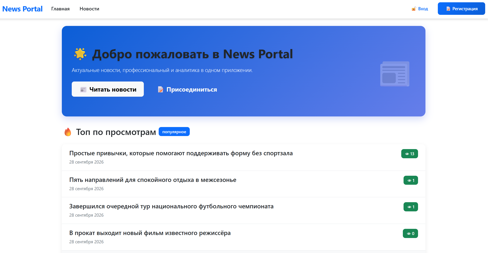 | 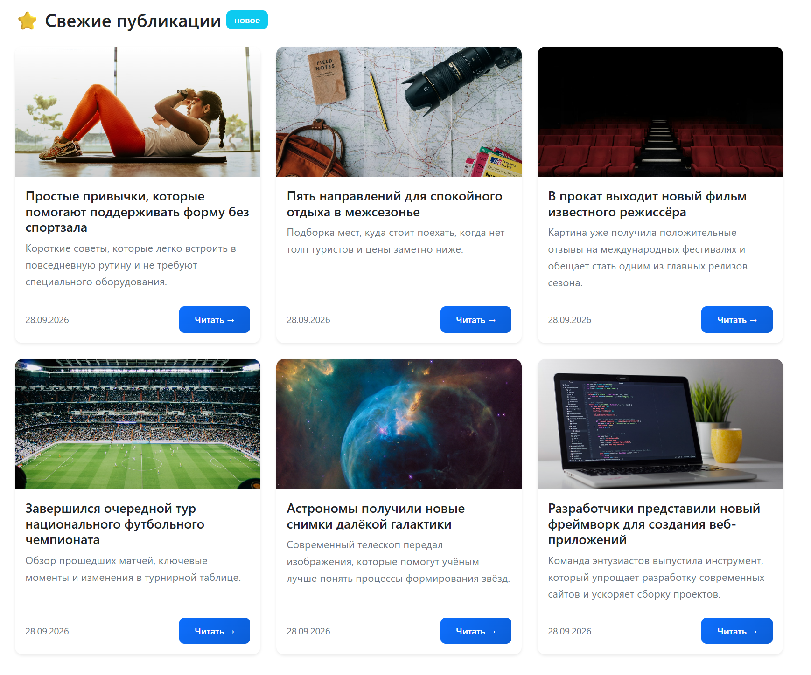 |

| Все новости | Страница новости |
|---|---|
| 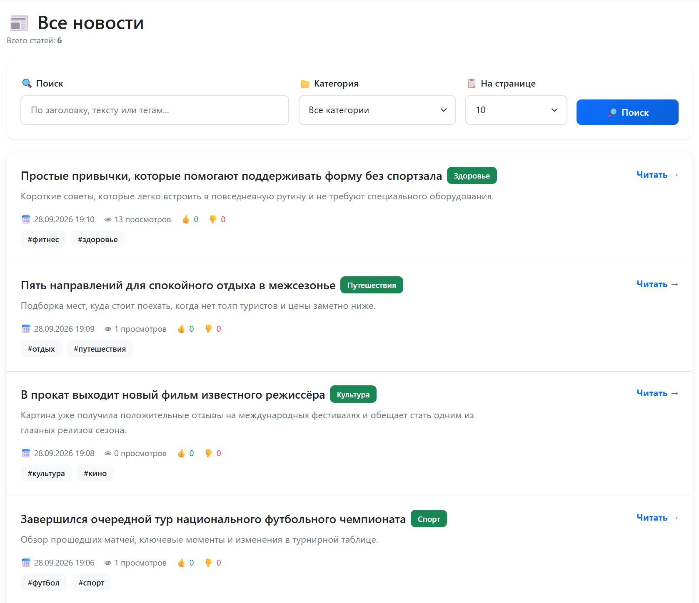 | 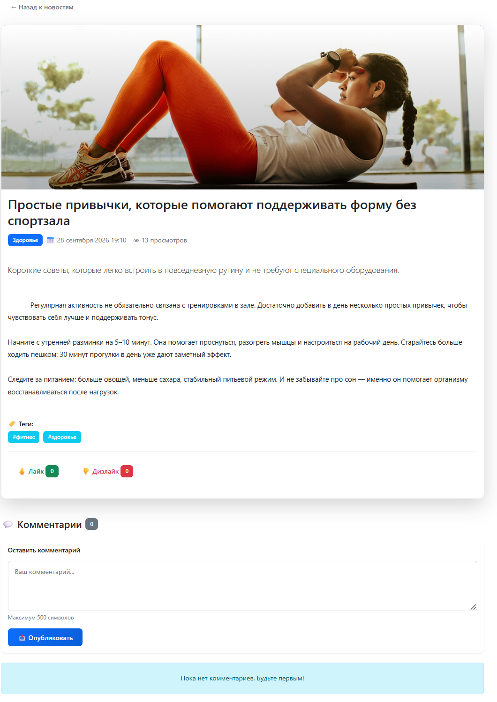 |

| Вход | Регистрация |
|---|---|
| 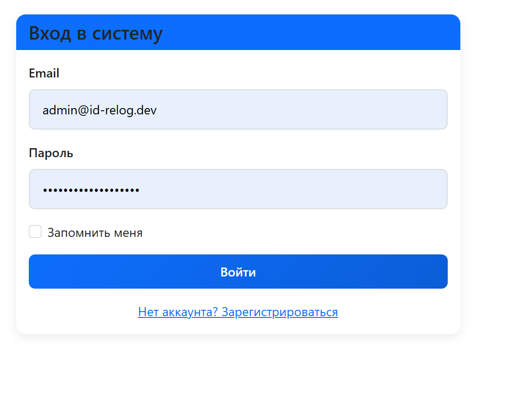 | 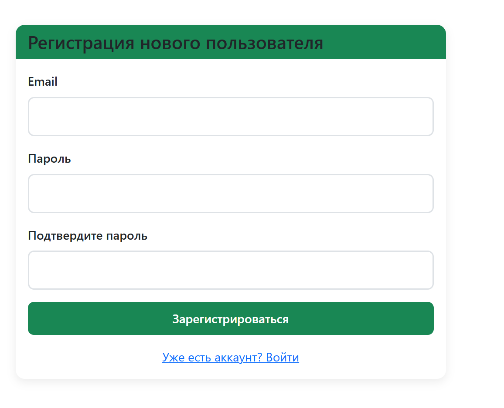 |

### Админ-панель

| Управление новостями | Категории |
|---|---|
| 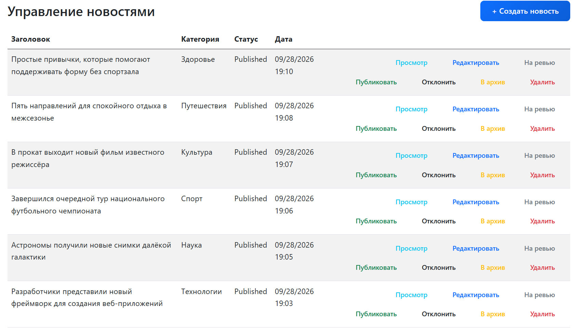 | 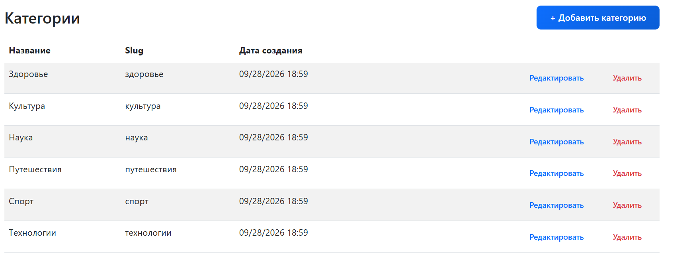 |

| Пользователи | Редактирование ролей |
|---|---|
| 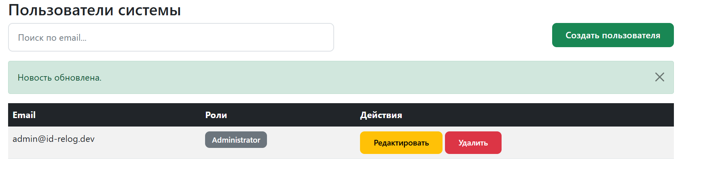 | 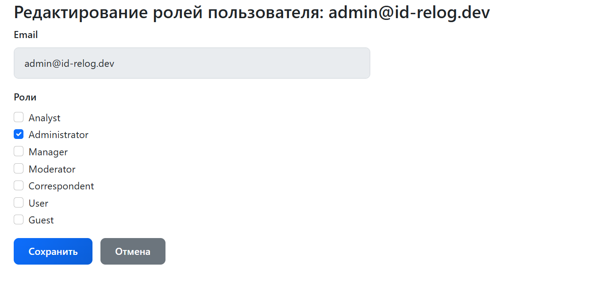 |

| Аналитика |
|---|
| 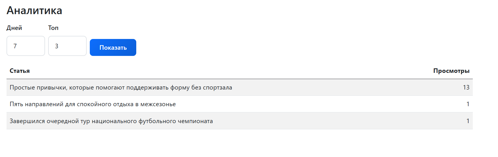 |

## Запуск локально

1. Установить [.NET 9 SDK](https://dotnet.microsoft.com/download) и PostgreSQL.

2. Создать базу данных: `CREATE DATABASE kursuchigi2;`

3. Настроить строку подключения (User Secrets):

   `dotnet user-secrets set "ConnectionStrings:postgresConnection" "Host=localhost;Port=5432;Database=kursuchigi2;Username=postgres;Password=ВАШ_ПАРОЛЬ" --project WebAppUI`

   Или отредактировать файл `WebAppUI/appsettings.Development.json` (он в `.gitignore`, в репозиторий не попадёт).

4. Применить миграции:

   `dotnet ef database update --project DAL --startup-project WebAppUI`

5. Запустить:

   `dotnet run --project WebAppUI`

## Автор

Vladimir — [GitHub](https://github.com/id-relog)